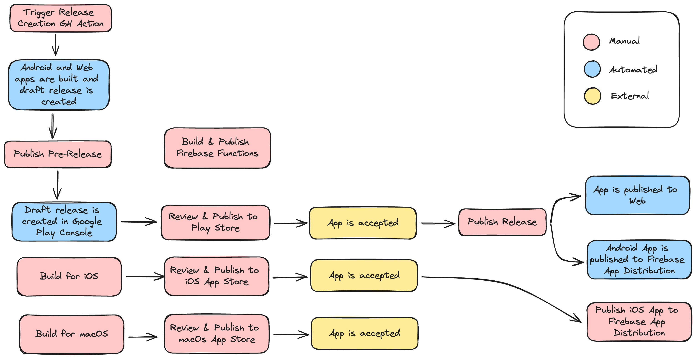

# Statera

**An expense tracking app with granular price distribution.**

Splitting a bill with your friends?
Paying for food and drinks on a Friday night?
Going on a trip together?

Statera helps you organize your expenses and does the math for you. Scan receipts, mark your items, finalize expenses and equalize your group's debts.


## Set up

### Requirements
- Flutter
- Dart
- `derry` [dart package](https://pub.dev/packages/derry) globally installed - for running custom commands
- [FlutterFire CLI](https://firebase.flutter.dev/docs/cli/) globally installed - for configuring Firebase
- Android and/or iOS emulator and/or Web for testing
- lcov - for testing with coverage

### Firebase

- Create an iOS/Android app in the Firebase console
- Include your `google-services.json` and `GoogleService-Info.plist` to the proper places as described in the [docs](https://firebase.google.com/docs/flutter/setup?platform=android)

## Development

To run the project locally follow these steps:
1. Install Flutter dependencies:
    ```
    flutter pub get
    ```
2. Run Firebase emulators:
    ```
    derry emulate
    ```
3. Create `.env`:
    ```
    cp .env.example .env
    ```

    Environment variable description:
    - `WEB_PUSH_VAPID_KEY` (optional) - used to enable web push notification
4. Run the project:

    `derry run-emulate` - prompts to choose the device

    `derry run-web-emulate` - runs in Chrome

    > :information_source: If using VSCode, launch configurations exist for running the app with Firebase emulators (Flutter: emulate) and with production data (Flutter: production)

### Commands
- `flutter run` - runs the project
- `flutterfire configure` - initializes the connection between you Firebase project and this Flutter project
- `derry emulate` - runs Firebase emulators for local development
- `derry test` - runs the tests

Full list of commands can be found in the `pubspec.yaml` file

## Testing

### Unit & Widget tests

These are fast tests that verify business logic functionality and behaviour of separate widgets.
Unit tests are contained under the `test` directory. 

Run unit tests:
```
flutter test
```

Include coverage report:
```
flutter test --coverage
```

### Integration tests

These tests run on a test version of Chrome while talking to an emulator version of Firebase.
Integration tests are contained under the `integration_test` directory while the driver is defined under the `test_driver` directory.

Run integration tests:
1. [Install the Chrome web driver](https://chromedriver.chromium.org/getting-started) (the version should match the version of your Chrome browser)
2. Start the Chrome web driver
    ```
    chromedriver --port=4444
    ```
3. Start the Firebase emulators
    ```
    firebase emulators:start --import ./emulator_data_testing
    ```
4. Runs the tests
    ```
    ./scripts/run_integration_tests_observe.sh
    ```

### Atomated screenshots

1. Configure the `scripts/take_screenshots_on_all_devices.sh` file to contain the devices you want to take screenshots on:
    ```
    ./scripts/take_screenshots.sh <device_id> <device_name>
    ```
    You can get the device id by running `flutter devices`

2. Start the desired simulators (make sure that the user is logged out if the device was used to run the app previously)

3. Run the script
    ```
    ./scripts/take_screenshots_on_all_devices.sh
    ```
4. The screenshots will be saved in the `screenshots` directory


Currently, there is an issue with [taking screenshots on iOS](https://github.com/flutter/flutter/issues/51890). There exists [a workaround](https://github.com/flutter/flutter/issues/91668#issuecomment-1132381182) and an [open PR](https://github.com/flutter/flutter/pull/116539).

## Publishing



## References & useful links

- icons generated through [Icon Kitchen](https://icon.kitchen)
- Trunk Based Development deployments with GitHub actions [article](https://blog.jannikwempe.com/github-actions-trunk-based-development)